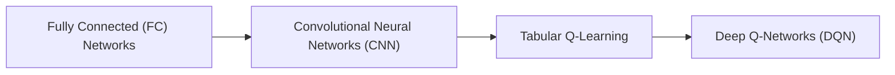

# 2048 Game AI: Neural Network Project

This project demonstrates the step-by-step progression in building an AI for the game **2048**, evolving from simple neural network models to advanced reinforcement learning solutions. Each stage highlights why increased complexity was necessary for improved gameplay performance.

---

## Project Goals

1. Develop AI capable of playing 2048 efficiently.
2. Explore different AI architectures: supervised learning (FC, CNN) and reinforcement learning (Q-learning, DQN).
3. Create a full pipeline: data preparation → model training → analysis → deployment.

---

## Project Progression

### 1. Basic Neural Network Training

* **Goal:** Understand neural network fundamentals.
* **Implementation:** Simple regression/classification using PyTorch (`train.py`).
* **Why:** Lays the foundation for model training, loss functions, and optimization.

### 2. Data Preparation & Cleaning

* **Goal:** Convert raw game logs into structured datasets.
* **Implementation:** `clean_data.py` prepares clean, consistent input data for training.
* **Why:** Effective learning requires clean and properly structured data.

### 3. Increasing Model Complexity

* **Goal:** Improve AI’s decision-making and strategic depth.
* **Implementation:** Experiment with deeper networks and advanced architectures (FC → CNN).
* **Why:** Simple models cannot capture the spatial and strategic patterns of 2048.

### 4. Reinforcement Learning

* **Goal:** Allow AI to learn strategies from interaction and rewards.
* **Implementation:** Q-learning (tabular) → Deep Q-Networks (`DQN.py`).
* **Why:** Reinforcement learning handles large state spaces and enables the AI to optimize long-term rewards.

### 5. Visualization & Analysis

* **Goal:** Understand AI decisions and debug strategies.
* **Implementation:** `visualizer.py`, `DQN_visualizer.py` for move inspection and model predictions.
* **Why:** Visualization helps refine AI strategies and benchmark performance.

### 6. Model Export & Integration

* **Goal:** Deploy AI in other environments (e.g., web applications).
* **Implementation:** Export models using ONNX (`fc_to_onnx.py`, `cnn_to_onnx.py`, `convert_model.py`).
* **Why:** Enables real-time AI gameplay in browsers or cross-platform applications.

---

## Project Structure (Current Status)

```
requirements.txt        # Python dependencies
train.py                # Basic training script
train_FC.py             # Fully Connected network training
train_CNN.py            # Convolutional network training
deep_Q_learning.py      # Deep Q-Learning logic
DQN.py                  # DQN implementation
tabular_qlearning.py    # Q-learning with table
heuristics_ai.py        # Early heuristic-based AI
game_engine.py          # 2048 game logic
clean_data.py           # Data cleaning utility
visualizer.py           # FC/CNN visualizations
DQN_visualizer.py       # DQN-specific visualizations
fc_to_onnx.py           # FC model export to ONNX
cnn_to_onnx.py          # CNN model export to ONNX
convert_model.py        # General model conversion/export
Qlearning_server.py     # Server for distributed Q-learning experiments

raw_data/               # Raw game logs
processed_data/         # Cleaned & structured datasets
trained_models/         # Saved trained models
Onnx_models/            # Exported models for web/JS
DQN_model/              # Saved DQN models
```

---

## Evolution of AI Architectures

### 1. Fully Connected (FC) Networks

* **Why Start Here:** Simple and easy to implement.
* **Pros:** Quick experiments; treats board as a flat vector.
* **Limitation:** Ignores spatial relationships; struggles with advanced strategies.

### 2. Convolutional Neural Networks (CNN)

* **Why Move to CNN:** Captures spatial patterns and local tile interactions.
* **Pros:** Learns better strategies than FC networks.
* **Limitation:** Still relies on supervised learning; may miss optimal long-term strategies if heuristics are poor.

### 3. Q-Learning (Tabular)

* **Why Try Q-Learning:** Introduces reinforcement learning and reward-based learning.
* **Pros:** Learns strategies from experience rather than hand-crafted rules.
* **Limitation:** Only works for small state spaces; 2048 board states are too large to scale efficiently.

### 4. Deep Q-Networks (DQN)

* **Why Move to DQN:** Combines deep learning with Q-learning for large state spaces.
* **Pros:** Learns complex strategies, generalizes across many board configurations.
* **Result:** Best performance; balances learning efficiency and strategic depth.

---

## Setup Instructions

1. Install dependencies:

```bash
pip install -r requirements.txt
```

2. Prepare data:

```bash
python clean_data.py
```

3. Train the model:

```bash
python train.py
```

4. Export for web/JS (optional):

```bash
python convert_model.py
```

5. Visualize results:

```bash
python visualizer.py
```

---

## AI Evolution Flowchart



* **FC → CNN:** Capture spatial board patterns.
* **CNN → QL:** Introduce reinforcement learning for strategic decision-making.
* **QL → DQN:** Scale to large state spaces and optimize gameplay.

---

## Summary

This project provides a **complete pipeline** for building a 2048 AI:

* Starts with **basic supervised learning** (FC, CNN).
* Moves to **reinforcement learning** (tabular Q-learning → DQN) for smarter gameplay.
* Includes **data cleaning, visualization, model export, and deployment**.
* Each architectural transition addresses limitations in the previous method, leading to a **robust, high-performing AI** capable of mastering 2048.
